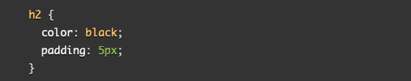

# CLASS 2 READING NOTES

**Reflections**

The below information is useful and related to what we are studying in this module because is basic content that needs to be learnt in order to expand our knowledge in HTML, CSS and JavaScript. 

### HTML

**Why is important to use semantic elements in our HTML?**

It is important to use semantic elements because these elements already have a meaning, so just by reading the code the user knows what is a title or a heading, if there is a subtitle, where the main information goes, as this will be within a paragraph. If there’s more than one chunk or information or there are more, etc.
By styling your text with CSS you can virtually make any piece of information look like you want it to look. You could just write the whole code within the < body > tag and style it to look like a title, subtitle, paragraph, etc. However it wouldn’t be really programmer-friendly and wouldn’t definitely follow the recommended practices.
Moreover, the value of semantic elements is also used by search engines as well as screen readers.

**How many levels of head are there in HTML?**

There are six levels of headings in HTML, being < h1 > the biggest and < h6 > the smallest.

**What are some uses for the < sup > and < sub > elements?**

The superscript tag is needed to create the small ‘th’ in 25th  or mathematical equations, and the subscript tag is used when writing chemical formulae.

**When using the < abbr > element, what attribute must be added to provide the full expansion of the term?**

The ‘title’ attribute.

### CSS

**What are ways we can apply CSS to our HTML?**

CSS can be applied through an external stylesheet, which is a separate file with .css extension linked in the < head > of the HTML document. 
It can also be applied through an internal stylesheet, which will also live in the HTML document. To do so, you have to place the CSS inside a < style > element within the < head >.
The third and last option is inline styling, which are declarations that affect the HTML element, contained within the style attribute.

**Why should we avoid using inline styles?**

We should avoid using inline styles because of the clutter it will cause to our HTML document, which would make it difficult to read, navigate and find possible errors. It is recommended to always use an external stylesheet.

**Review the block of code below and answer the following questions:**

**What is representing the selector?**

A level 2 heaading.

**Which components are the CSS declarations?**

Everything between the curly braces and semicolons.

**Which components are considered properties?**

Color and padding.

### JavsScript

**What data type is a sequence of text enclosed in single quote marks?**

A string.

**List 4 types of JS operators.**

- Assignment, which assigns a value to a variable and it’s represented as follows: =

- Addition, which adds two numbers together or combines strings and it’s represented as follows: +

- Strict equal, which performs a test to see if two values are equal and returns a true/false result (boolean). It is represented as follows: ===

- Does-not-equal, which tests whether two values are not equal and it is represented as follows: !==

**Describe a real world problem you could solve with a function.**

You are buying something online and you enter a home address that doesn’t exist, so when you want to continue the page sends you an error message and doesn’t allow you to move to the next page. IF a valid address is entered, continue, ELSE send an error.

**An IF statement checks a *condition* and if it evaluates to *true,* then the code block executes.**

**What is the use of an 'else if'?**

The above statement is used when more than two options or outcomes want to be provided.  

**List 3 different types of comparion operators.**

- === and !== tests if one value is identical to, or not identical to, another.

- < and > tests if one value is less than or greater than another.

- <= and >= tests if one value is less an or equal to, or greater than or equal to, another.

**What is the difference between the logical operator && and ||?**

The first means ‘and’ and allows you to chain together two or more expressions, however all of them have to evaluate to ‘true’ for the whole expression to return ‘true’.
The second means ‘or’ allows you to chain together two or more expressions, however only one of them has to individually evaluate to ‘true’ for the whole expression to return ‘true’.
